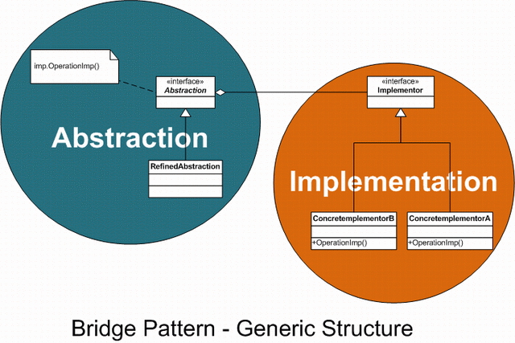

[Источник описания][source]
####Мост(Bridge)

Когда абстракция и реализация разделены, они могут изменяться независимо. Другими словами, при реализации через паттерн мост, изменение структуры интерфейса не мешает изменению структуры реализации. Рассмотрим такую абстракцию как фигура. Существует множество типов фигур, каждая со своими свойствами и методами. Однако есть что-то, что объединяет все фигуры. Например, каждая фигура должна уметь рисовать себя, масштабироваться и т. п. В то же время рисование графики может отличаться в зависимости от типа ОС, или графической библиотеки. Фигуры должны иметь возможность рисовать себя в различных графических средах, но реализовывать в каждой фигуре все способы рисования или модифицировать фигуру каждый раз при изменении способа рисования непрактично. В этом случае помогает шаблон bridge, позволяя создавать новые классы, которые будут реализовывать рисование в различных графических средах. При использовании такого подхода очень легко можно добавлять как новые фигуры, так и способы их рисования.
Связь, изображаемая стрелкой на диаграммах, может иметь 2 смысла: а) "разновидность", в соответствии с принципом подстановки Б. Лисков и б) одна из возможных реализаций абстракции. Обычно в языках используется наследование для реализации как а), так и б), что приводит к разбуханию иерархий классов.
Мост служит именно для решения этой проблемы: объекты создаются парами из объекта класса иерархии А и иерархии B, наследование внутри иерархии А имеет смысл "разновидность" по Лисков, а для понятия "реализация абстракции" используется ссылка из объекта A в парный ему объект B.

######Цель
При частом изменении класса преимущества объектно-ориентированного подхода становятся очень полезными, позволяя делать изменения в программе, обладая минимальными сведениями о реализации программы. Шаблон bridge является полезным там, где часто меняется не только сам класс, но и то, что он делает.

[source]:http://ru.wikipedia.org/wiki/%D0%9C%D0%BE%D1%81%D1%82_(%D1%88%D0%B0%D0%B1%D0%BB%D0%BE%D0%BD_%D0%BF%D1%80%D0%BE%D0%B5%D0%BA%D1%82%D0%B8%D1%80%D0%BE%D0%B2%D0%B0%D0%BD%D0%B8%D1%8F)